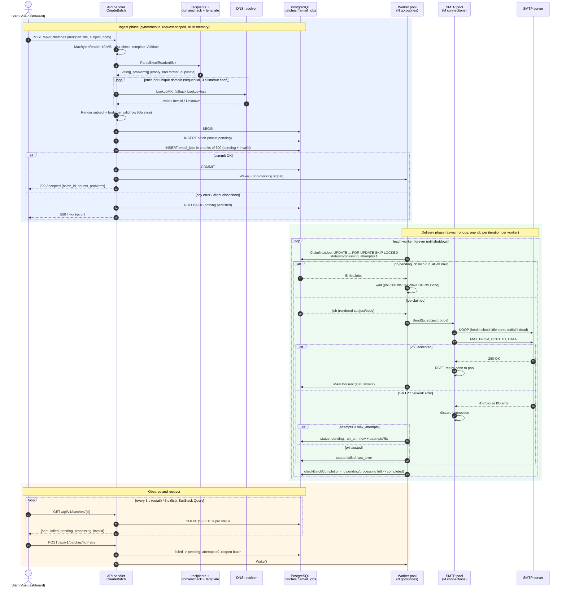

```mermaid
sequenceDiagram
    autonumber
    actor Staff as Staff (Vue dashboard)
    participant API as API handler<br/>CreateBatch
    participant Parse as recipients +<br/>domaincheck + template
    participant DNS as DNS resolver
    participant DB as PostgreSQL<br/>batches / email_jobs
    participant W as Worker pool<br/>(N goroutines)
    participant Pool as SMTP pool<br/>(M connections)
    participant SMTP as SMTP server

    rect rgb(235, 242, 255)
    Note over Staff,DB: Ingest phase (synchronous, request-scoped, all in memory)
    Staff->>API: POST /api/v1/batches (multipart: file, subject, body)
    API->>API: MaxBytesReader 10 MB, .xlsx check, template.Validate
    API->>Parse: ParseExcelReader(file)
    Parse-->>API: valid[], problems[] (empty, bad format, duplicate)
    loop once per unique domain (sequential, 3 s timeout each)
        API->>DNS: LookupMX, fallback LookupHost
        DNS-->>API: Valid / Invalid / Unknown
    end
    API->>API: Render subject + body per valid row (Go slice)
    API->>DB: BEGIN
    API->>DB: INSERT batch (status pending)
    API->>DB: INSERT email_jobs in chunks of 500 (pending + invalid)
    alt commit OK
        API->>DB: COMMIT
        API->>W: Wake() (non-blocking signal)
        API-->>Staff: 202 Accepted {batch_id, counts, problems}
    else any error / client disconnect
        API->>DB: ROLLBACK (nothing persisted)
        API-->>Staff: 500 / 4xx {error}
    end
    end

    rect rgb(236, 250, 240)
    Note over W,SMTP: Delivery phase (asynchronous, one job per iteration per worker)
    loop each worker, forever until shutdown
        W->>DB: ClaimNextJob: UPDATE ... FOR UPDATE SKIP LOCKED<br/>status=processing, attempts+1
        alt no pending job with run_at <= now
            DB-->>W: ErrNoJobs
            W->>W: wait (poll 500 ms OR Wake OR ctx.Done)
        else job claimed
            DB-->>W: job (rendered subject/body)
            W->>Pool: Send(to, subject, body)
            Pool->>SMTP: NOOP (health check idle conn, redial if dead)
            Pool->>SMTP: MAIL FROM, RCPT TO, DATA
            alt 250 accepted
                SMTP-->>Pool: 250 OK
                Pool->>Pool: RSET, return conn to pool
                W->>DB: MarkJobSent (status=sent)
            else SMTP / network error
                SMTP-->>Pool: 4xx/5xx or I/O error
                Pool->>Pool: discard connection
                alt attempts < max_attempts
                    W->>DB: status=pending, run_at = now + attempts*5s
                else exhausted
                    W->>DB: status=failed, last_error
                end
            end
            W->>DB: checkBatchCompletion (no pending/processing left -> completed)
        end
    end
    end

    rect rgb(255, 246, 230)
    Note over Staff,DB: Observe and recover
    loop every 3 s (detail) / 5 s (list), TanStack Query
        Staff->>API: GET /api/v1/batches/{id}
        API->>DB: COUNT(*) FILTER per status
        API-->>Staff: {sent, failed, pending, processing, invalid}
    end
    Staff->>API: POST /api/v1/batches/{id}/retry
    API->>DB: failed -> pending, attempts=0, reopen batch
    API->>W: Wake()
    end
```
